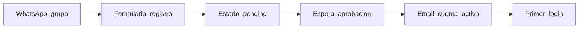
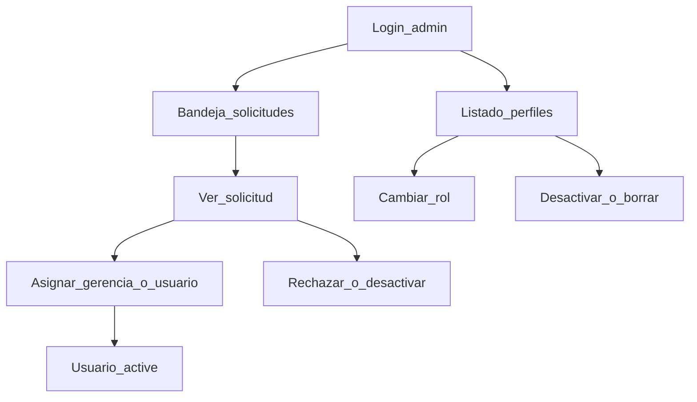
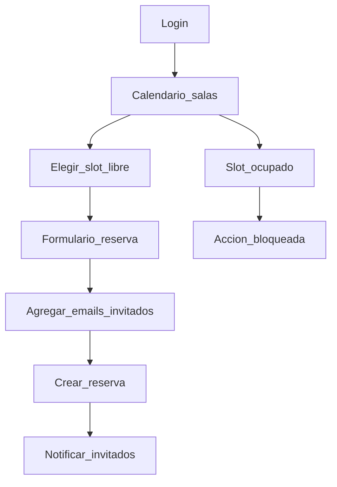
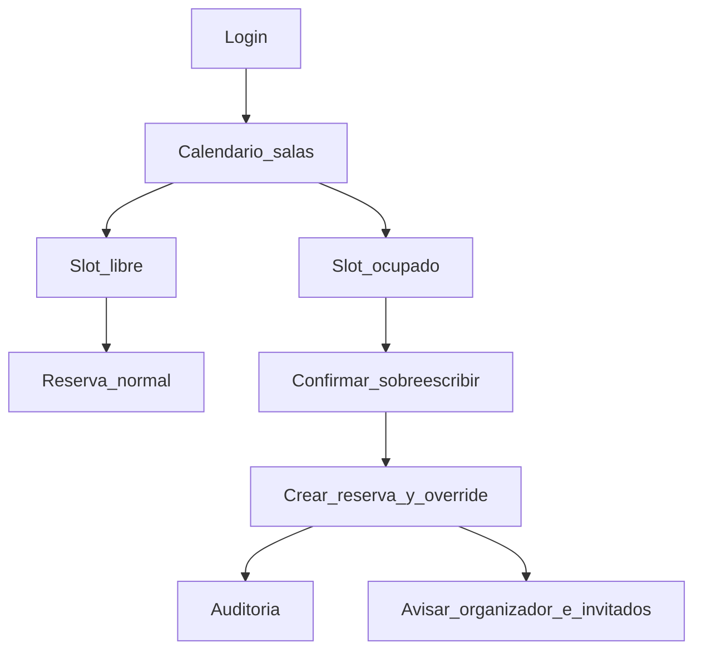
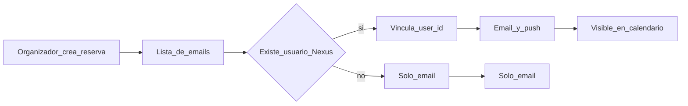

# 02 — Journey maps por rol

## Resumen de actores

| Actor | Entra cuando… | Objetivo principal |
|-------|----------------|--------------------|
| Persona interesada | Recibe enlace por WhatsApp | Crear solicitud de cuenta |
| Admin | Hay solicitudes o hay que gestionar perfiles | Aprobar, asignar rol, dar de baja |
| Usuario general | Cuenta activa | Reservar salas libres e invitar |
| Gerencia | Cuenta activa | Reservar y, si hace falta, sobreescribir |

---

## 1. Persona interesada → cuenta pendiente

### Pasos

1. Recibe el enlace o la indicación de usar Nexus Calendar por el grupo de WhatsApp.
2. Abre el formulario de registro.
3. Completa **nombre**, **correo institucional** y **teléfono**.
4. El sistema crea el usuario en estado `pending`, **sin rol**.
5. Ve una pantalla de confirmación: “Tu solicitud está en revisión”.
6. No puede acceder al calendario ni reservar.
7. Cuando el admin aprueba y asigna rol, recibe correo (y push si ya instaló la PWA y dio permisos).
8. Inicia sesión y entra al flujo de su rol (`usuario` o `gerencia`).

### Puntos de dolor / mitigación

| Dolor | Mitigación |
|-------|------------|
| No sabe si lo aprobaron | Email al aprobar + estado visible si intenta login |
| Correo mal escrito | Validación de formato; opcional dominio institucional |
| Intenta registrarse dos veces | Email único; mensaje claro si ya existe |

---

## 2. Administrador

### Pasos — aprobación

1. Inicia sesión con rol `admin`.
2. Ve la bandeja de solicitudes `pending` (prioridad visual).
3. Abre el detalle: nombre, correo, teléfono, fecha de solicitud.
4. Elige rol `gerencia` o `usuario` y aprueba.
5. El sistema pasa a `active`, guarda `approved_at` / `approved_by`, registra auditoría y dispara notificación.
6. Opcionalmente rechaza (`rejected`) o más adelante desactiva (`disabled`).

### Pasos — CRUD de perfiles

1. Lista usuarios con filtros (estado, rol, búsqueda por nombre/correo).
2. Cambia rol de un usuario activo.
3. Desactiva o elimina perfil (preferible soft-delete `disabled`).
4. No gestiona el día a día de reservas en v1; puede consultarse auditoría de overrides (recomendado).

### Permisos exclusivos

- Aprobar / rechazar solicitudes.
- Asignar y cambiar roles.
- Desactivar / borrar perfiles.

---

## 3. Usuario general

### Pasos — reserva

1. Inicia sesión (`active` + rol `usuario`).
2. Ve el calendario: salas, ocupaciones y próximas reuniones.
3. Filtra por sala o día según la UI.
4. Elige un horario **libre**.
5. Completa: fecha (≥ mañana), hora inicio/fin, nombre, descripción opcional, sala.
6. Invita personas por correo electrónico.
7. Confirma. El sistema valida anticipación y solapes.
8. Si hay conflicto → error claro, no se crea.
9. Si OK → reserva `confirmed`; invitados reciben email + push; el evento aparece en calendarios Nexus de organizador e invitados vinculados.

### Lo que no puede hacer

- Sobreescribir una sala ocupada.
- Autoasignarse rol `gerencia` o `admin`.
- Gestionar perfiles de otros.

---

## 4. Gerencia

### Pasos — reserva normal

Igual que usuario general cuando el slot está libre.

### Pasos — override

1. Selecciona un horario ya ocupado (o envía reserva que solapa).
2. El sistema muestra confirmación: sala, organizador actual, horario, título de la reserva afectada.
3. Confirma sobreescritura.
4. Reservas en conflicto pasan a `overridden` (con enlace a la nueva reserva).
5. Se crea la reserva de gerencia como `confirmed`.
6. Se escribe `audit_logs` (`reservation.overridden`).
7. Se notifica a organizador previo e invitados (email + push).

### Anticipación

En v1, gerencia **también** respeta el día de anticipación. Si más adelante se decide exceptuar a gerencia, se documenta como cambio de regla explícito.

---

## 5. Journey transversal — invitación

1. Organizador añade correos en el formulario.
2. Sistema normaliza emails (minúsculas) y deduplica.
3. Si el email pertenece a un usuario `active`, se vincula `user_id` y el evento entra en su calendario.
4. Si no, queda invitación por email (y podrá verse al registrarse/aprobarse en una fase posterior, si se implementa matching).
5. En v1, `invite_status` puede quedar en `accepted` implícito al crear; aceptación explícita es v1.1.

---

## 6. Mapa emocional / operativo (resumen)

| Etapa | Emoción / necesidad | Respuesta del producto |
|-------|---------------------|------------------------|
| Registro | Esperanza / incertidumbre | Mensaje claro de pendiente |
| Espera admin | Impaciencia | Email al aprobar |
| Ver calendario | Orientación | Ocupado vs libre visible |
| Reservar (usuario) | Frustración si choca | Bloqueo + alternativa de horario |
| Override (gerencia) | Urgencia institucional | Confirmación + aviso a desplazados |
| Invitación | No enterarse | Push distintivo + email fallback |
