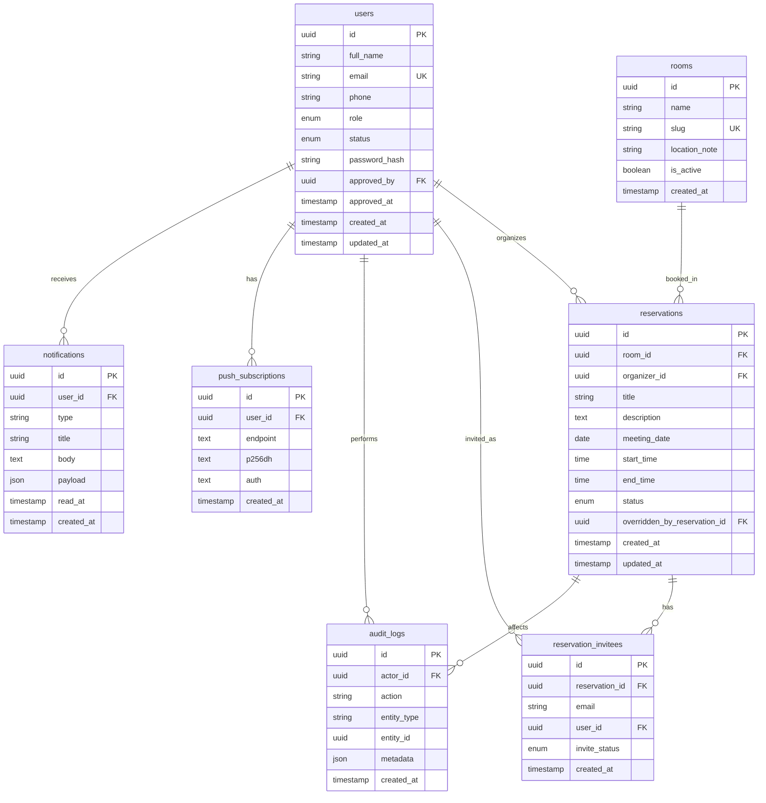

# 03 — Modelo de datos

## Diagrama entidad-relación



## Convenciones

- Claves primarias: `uuid`.
- Emails siempre normalizados a minúsculas.
- Zona horaria de negocio: `America/Bogota`.
- Soft-delete de usuarios vía `status = disabled` (no borrar filas de historial de reservas).
- Timestamps en UTC en base de datos; presentación en hora local de la clínica.

---

## Tabla `users`

| Campo | Tipo | Notas |
|-------|------|-------|
| `id` | uuid PK | |
| `full_name` | varchar | Obligatorio |
| `email` | varchar UK | Correo institucional |
| `phone` | varchar | Obligatorio en registro |
| `role` | enum nullable | `admin` \| `gerencia` \| `usuario`; null si `pending` |
| `status` | enum | `pending` \| `active` \| `rejected` \| `disabled` |
| `password_hash` | varchar nullable | Según estrategia de auth |
| `approved_by` | uuid FK → users | Null hasta aprobación |
| `approved_at` | timestamp nullable | |
| `created_at` / `updated_at` | timestamp | |

**Índices:** único en `email`; índice en `(status)`, `(role)`.

---

## Tabla `rooms`

| Campo | Tipo | Notas |
|-------|------|-------|
| `id` | uuid PK | |
| `name` | varchar | Nombre visible |
| `slug` | varchar UK | Ej. `sala-juntas-nexus` |
| `location_note` | varchar nullable | Ubicación / aclaración |
| `is_active` | boolean | Default true |
| `created_at` | timestamp | |

### Seed v1

| name | slug |
|------|------|
| Sala de juntas Nexus | `sala-juntas-nexus` |
| Sede Violeta | `sede-violeta` |
| Tercer piso sede hospitalaria (cafetería) | `tercer-piso-cafeteria` |

---

## Tabla `reservations`

| Campo | Tipo | Notas |
|-------|------|-------|
| `id` | uuid PK | |
| `room_id` | uuid FK → rooms | |
| `organizer_id` | uuid FK → users | |
| `title` | varchar | Nombre de la reunión |
| `description` | text nullable | Opcional |
| `meeting_date` | date | Día de la reunión |
| `start_time` | varchar(5) | Hora entrada en `HH:mm` |
| `end_time` | varchar(5) | Hora salida en `HH:mm`; debe ser > `start_time` |
| `status` | enum | `confirmed` \| `cancelled` \| `overridden` |
| `overridden_by_reservation_id` | uuid FK → reservations nullable | Reserva de gerencia que la reemplazó |
| `created_at` / `updated_at` | timestamp | |

**Índices recomendados:**

- `(room_id, meeting_date)`
- `(organizer_id, meeting_date)`
- `(status)`

Las horas se guardan como texto `HH:mm` con cero a la izquierda: el orden lexicográfico coincide con el cronológico, así que las comparaciones de solape funcionan igual que con `time` y se evita la conversión a `Date` en UTC. Ver [technical-spec](../specs/technical-spec.md).

**Detección de solape (misma sala, mismo día, ambas `confirmed`):**

```
existing.start_time < new.end_time
AND existing.end_time > new.start_time
```

Intervalo semiabierto `[start, end)` evita choque exacto borde-a-borde (una termina a las 10:00 y otra empieza a las 10:00 → permitido).

---

## Tabla `reservation_invitees`

| Campo | Tipo | Notas |
|-------|------|-------|
| `id` | uuid PK | |
| `reservation_id` | uuid FK → reservations | Cascade on delete de reserva según política |
| `email` | varchar | Obligatorio |
| `user_id` | uuid FK → users nullable | Si el email ya es usuario Nexus |
| `invite_status` | enum | `pending` \| `accepted` \| `declined` |
| `created_at` | timestamp | |

**Único compuesto:** `(reservation_id, email)`.

En v1 se puede marcar `accepted` al crear (invitación informativa). Aceptación explícita → v1.1.

---

## Tabla `push_subscriptions`

| Campo | Tipo | Notas |
|-------|------|-------|
| `id` | uuid PK | |
| `user_id` | uuid FK → users | Un usuario, varios dispositivos |
| `endpoint` | text | Web Push endpoint |
| `p256dh` | text | Clave cliente |
| `auth` | text | Secreto auth |
| `created_at` | timestamp | |

**Único:** `endpoint` (o `(user_id, endpoint)`).

---

## Tabla `notifications` (recomendada)

Historial in-app y respaldo si el push falla.

| Campo | Tipo | Notas |
|-------|------|-------|
| `id` | uuid PK | |
| `user_id` | uuid FK → users | |
| `type` | varchar | Ej. `account.approved`, `reservation.invite`, `reservation.overridden` |
| `title` | varchar | |
| `body` | text | |
| `payload` | jsonb | ids relacionados |
| `read_at` | timestamp nullable | |
| `created_at` | timestamp | |

---

## Tabla `audit_logs`

Append-only.

| Campo | Tipo | Notas |
|-------|------|-------|
| `id` | uuid PK | |
| `actor_id` | uuid FK → users nullable | Sistema puede ser null |
| `action` | varchar | Ver catálogo abajo |
| `entity_type` | varchar | `user`, `reservation`, etc. |
| `entity_id` | uuid | |
| `metadata` | jsonb | Antes/después, ids afectados |
| `created_at` | timestamp | |

### Acciones mínimas

- `user.registered`
- `user.approved`
- `user.rejected`
- `user.role_changed`
- `user.disabled`
- `user.deleted`
- `reservation.created`
- `reservation.cancelled`
- `reservation.overridden`

---

## Relaciones clave (resumen)

| Desde | Hacia | Cardinalidad | Significado |
|-------|-------|--------------|-------------|
| users | reservations | 1:N | Organizador |
| rooms | reservations | 1:N | Sala reservada |
| reservations | reservation_invitees | 1:N | Invitados |
| users | reservation_invitees | 1:N | Invitado registrado |
| reservations | reservations | 1:N | Override (`overridden_by_reservation_id`) |
| users | push_subscriptions | 1:N | Dispositivos PWA |
| users | audit_logs | 1:N | Quién hizo la acción |
| users | notifications | 1:N | Bandeja del usuario |

---

## Máquinas de estado

### Usuario

```text
pending → active    (admin aprueba + asigna rol)
pending → rejected  (admin rechaza)
active  → disabled  (admin da de baja)
rejected → active   (opcional: reabrir y aprobar)
disabled → active   (opcional: reactivar)
```

### Reserva

```text
(create) → confirmed
confirmed → cancelled   (organizador o gerencia/admin según permiso)
confirmed → overridden  (gerencia fuerza otra reserva en el mismo intervalo)
```

Una reserva `overridden` o `cancelled` **no** bloquea nuevos solapes.

---

## Integridad de negocio (checklist)

1. No login de calendario si `status != active` o `role` es null.
2. `end_time > start_time`.
3. `meeting_date >= tomorrow` (Bogotá) al crear.
4. Solape solo permitido vía flujo override de `gerencia`.
5. Emails de invitados deduplicados por reserva.
6. Al desactivar usuario, sus reservas futuras pueden cancelarse o reasignarse (definir en implementación; recomendación v1: dejar historial y cancelar futuras `confirmed` del organizador, notificando invitados).
