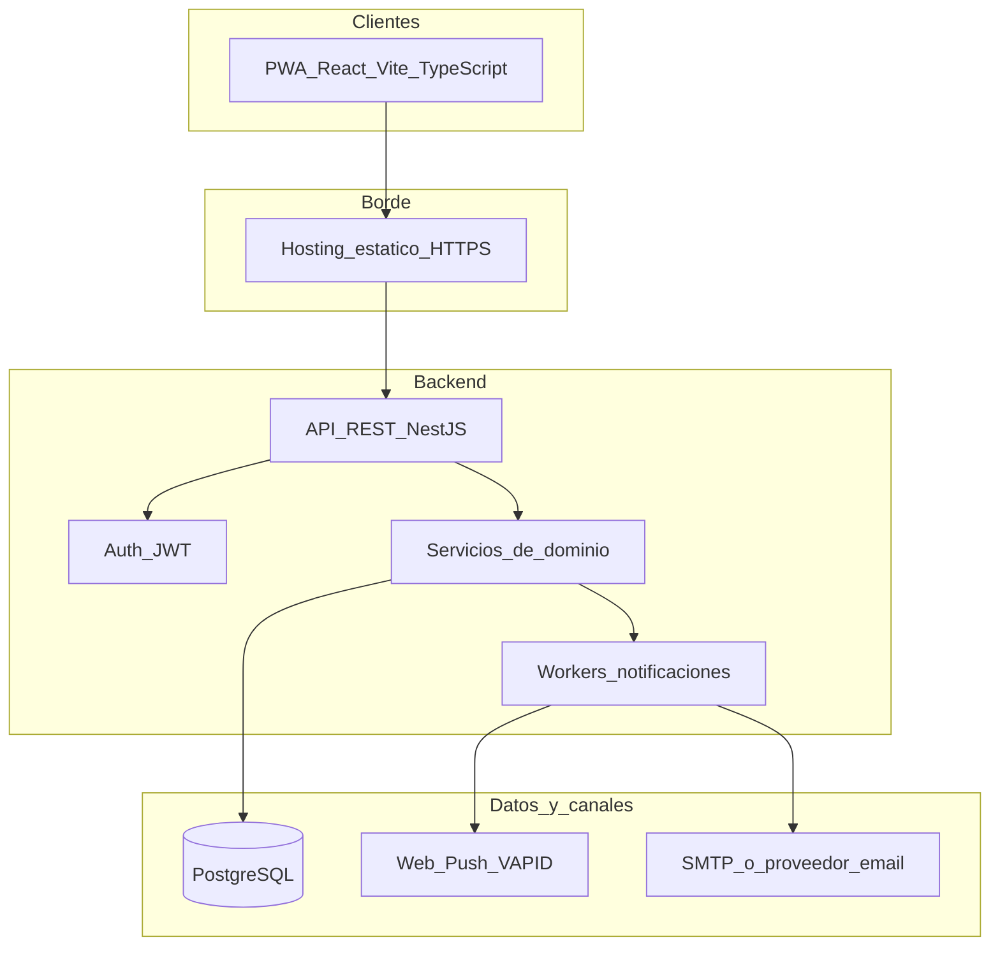

# 04 — Arquitectura de software

## Vista general

Nexus Calendar es una **PWA** (cliente) que habla con una **API REST** respaldada por **PostgreSQL**, con workers para email y Web Push.



## Stack decidido

| Capa | Tecnología | Motivo |
|------|------------|--------|
| Frontend | React + Vite + TypeScript | Buen soporte PWA, ecosistema móvil web |
| PWA | Vite PWA / Workbox | Instalable en celulares, offline básico de shell |
| UI calendario | Librería de calendario (semana/día) | Foco en ocupación por sala |
| Backend | NestJS + TypeScript | Módulos claros, guards por rol |
| Base de datos | PostgreSQL | Relacional, constraints, auditoría |
| Auth | JWT (access + refresh) tras cuenta `active` | Simple para app interna |
| Push | Web Push con VAPID | Nativo de PWA |
| Email | SMTP institucional o Resend/SendGrid | Aprobaciones e invitaciones |
| Hosting | Estático (frontend) + contenedor/VPS (API) | Adecuado a proyecto de práctica |

**Nota:** Si el equipo prefiere Flutter Web, el **dominio y el modelo de datos no cambian**; solo el cliente.

## Capas lógicas

1. **Presentación (PWA):** pantallas, formularios, suscripción push, calendar UI.
2. **API / aplicación:** autenticación, autorización RBAC, validación de DTOs, orquestación.
3. **Dominio:** reglas de anticipación, solapes, override, aprobación de usuarios.
4. **Infraestructura:** PostgreSQL, mailer, web-push, logger, jobs.

## Módulos backend

| Módulo | Responsabilidad |
|--------|-----------------|
| `AuthModule` | Registro, login, refresh, guards |
| `UsersModule` | Perfil, aprobación admin, CRUD usuarios |
| `RoomsModule` | Listado de salas activas |
| `ReservationsModule` | Crear/listar/cancelar, overlap, override |
| `InvitesModule` | Resolución email → user, adjuntos a reserva |
| `NotificationsModule` | Cola email/push, plantillas, historial |
| `AuditModule` | Escritura append-only de auditoría |

## Pantallas PWA

| # | Pantalla | Roles |
|---|----------|-------|
| 1 | Login | Público |
| 2 | Registro / solicitud | Público |
| 3 | “Cuenta pendiente” | Solicitante |
| 4 | Calendario principal (filtro por sala) | `usuario`, `gerencia`, `admin` |
| 5 | Nueva reserva + invitados | `usuario`, `gerencia` |
| 6 | Detalle de reserva / confirmación override | `usuario`, `gerencia` |
| 7 | Mis reservas / invitaciones | Autenticados activos |
| 8 | Admin: solicitudes | `admin` |
| 9 | Admin: listado/edición de perfiles | `admin` |
| 10 | Ajustes: activar notificaciones | Autenticados |

Admin puede usar el calendario en modo consulta; el CRUD de reservas no es su foco en v1.

## Flujo de despliegue (conceptual)

```text
[Dev] → build PWA → CDN/hosting estático
[Dev] → build API  → servidor Node + PostgreSQL
HTTPS obligatorio (Push + service worker)
Variables: DATABASE_URL, JWT_SECRET, VAPID_*, SMTP_*
```

## Seguridad (baseline)

- HTTPS en todos los entornos expuestos.
- Contraseñas con hash fuerte (bcrypt/argon2).
- Guards por `role` + `status === active`.
- Rate limit en `register` y `login`.
- Validación de inputs (longitud, email, rangos de hora).
- No exponer `password_hash` ni keys push en respuestas.
- CORS restringido al origen de la PWA.
- Backups periódicos de PostgreSQL.

## Observabilidad mínima

- Logs estructurados de API (request id).
- Log de fallos de push/email en el worker.
- Consulta admin de `audit_logs` para overrides (recomendado).

## Decisiones de diseño UI (producto)

- Mobile-first; acción primaria visible (Reservar / Aprobar).
- Calendario como pieza central, no un dashboard de métricas.
- Confirmación explícita en override de gerencia.
- Mensajes de error de solape en lenguaje claro (“La sala ya está reservada por … de 10:00 a 11:00”).

## Estructura de carpetas propuesta (futuro código)

Solo referencia; **no se crea código en esta fase**.

```text
/
  apps/
    web/                 # PWA React
    api/                 # NestJS
  docs/                  # Arquitectura (este conjunto)
  README.md
```

Monorepo simple opcional; también válido separar repos. Para práctica se recomienda monorepo o al menos carpeta `docs` compartida como ahora.
