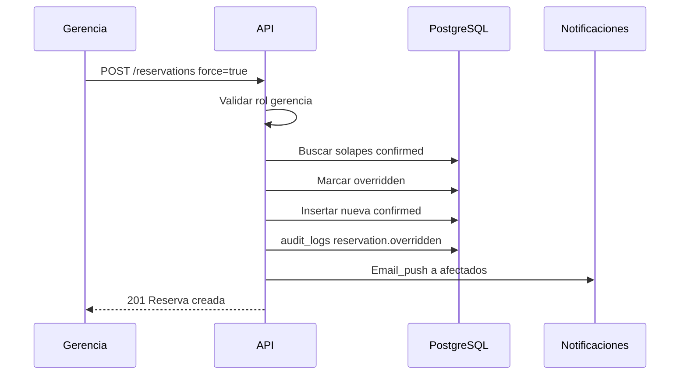

# 05 — Permisos y flujos

## Matriz RBAC

Leyenda: **S** = sí · **N** = no · **P** = solo propias · **C** = condicional

| Acción | Público | pending | usuario | gerencia | admin |
|--------|---------|---------|---------|----------|-------|
| Registrarse | S | N | N | N | N |
| Login a calendario | N | N | S | S | S |
| Ver calendario / ocupación | N | N | S | S | S |
| Crear reserva en slot libre | N | N | S | S | N* |
| Crear reserva con override | N | N | N | S | N |
| Cancelar reserva propia | N | N | P | P | N* |
| Cancelar reserva ajena | N | N | N | S | N* |
| Invitar por email | N | N | S | S | N |
| Aprobar / rechazar usuarios | N | N | N | N | S |
| Asignar / cambiar rol | N | N | N | N | S |
| Desactivar / borrar perfil | N | N | N | N | S |
| Ver auditoría overrides | N | N | N | N | S |

\* En v1 el admin se centra en usuarios. Si se necesita que admin también reserve, se documenta como excepción (`admin` hereda capacidades de `gerencia` o de solo lectura). **Decisión v1:** admin = gestión de personas + consulta calendario; no override salvo que se amplíe después.

## Reglas de autorización (resumen)

1. Toda ruta de negocio (excepto registro/login) exige JWT válido.
2. `status` debe ser `active`.
3. `role` debe estar asignado.
4. Override exige `role === gerencia` **y** flag explícito de confirmación (`force: true` o endpoint dedicado).
5. Admin no se autoasigna desde registro público: el primer admin se crea por seed/manual.

---

## Flujos API conceptuales

Base: `/api/v1`. Contratos orientativos para implementación futura.

### Auth y registro

| Método | Ruta | Quién | Descripción |
|--------|------|-------|-------------|
| `POST` | `/auth/register` | Público | Crea user `pending`. Body: `fullName`, `email`, `phone`, `password` |
| `POST` | `/auth/login` | Público | Solo si `active`. Devuelve tokens |
| `POST` | `/auth/refresh` | Auth | Renueva access token |
| `GET` | `/auth/me` | Auth | Perfil + rol + status |

**Errores de login útiles:** cuenta pendiente, rechazada, desactivada.

### Admin — usuarios

| Método | Ruta | Descripción |
|--------|------|-------------|
| `GET` | `/admin/users?status=pending` | Bandeja de solicitudes |
| `GET` | `/admin/users` | Listado con filtros |
| `PATCH` | `/admin/users/:id/approve` | Body: `{ "role": "gerencia" \| "usuario" }` |
| `PATCH` | `/admin/users/:id/reject` | Rechazo |
| `PATCH` | `/admin/users/:id/role` | Cambio de rol |
| `DELETE` | `/admin/users/:id` | Soft-delete → `disabled` |

Efectos colaterales de `approve`: email + notificación + `audit_logs`.

### Salas

| Método | Ruta | Descripción |
|--------|------|-------------|
| `GET` | `/rooms` | Salas `is_active = true` |

### Reservas

| Método | Ruta | Descripción |
|--------|------|-------------|
| `GET` | `/reservations` | Query: `from`, `to`, `roomId` |
| `GET` | `/reservations/:id` | Detalle + invitados |
| `POST` | `/reservations` | Crear (valida anticipación y solapes) |
| `POST` | `/reservations` + `force: true` | Solo gerencia; ejecuta override |
| `DELETE` | `/reservations/:id` | Cancelar (permisos según matriz) |

#### Body create (conceptual)

```json
{
  "roomId": "uuid",
  "title": "Comité calidad",
  "description": "Opcional",
  "meetingDate": "2026-08-08",
  "startTime": "10:00",
  "endTime": "11:00",
  "inviteeEmails": ["persona@clinica.example"],
  "force": false
}
```

#### Algoritmo create

1. Verificar auth + rol permitido.
2. Validar `endTime > startTime`.
3. Validar `meetingDate >= tomorrow` (Bogotá).
4. Buscar solapes `confirmed` en misma sala/fecha.
5. Si hay solapes y `force !== true` → `409 Conflict` con detalle.
6. Si hay solapes y `force === true` y rol `gerencia`:
   - marcar solapadas como `overridden`
   - set `overridden_by_reservation_id`
   - audit + notificaciones
7. Insertar reserva `confirmed` + invitados.
8. Encolar email/push a invitados.

### Push

| Método | Ruta | Descripción |
|--------|------|-------------|
| `POST` | `/push/subscribe` | Guarda subscription del navegador |
| `DELETE` | `/push/subscribe` | Elimina subscription |

---

## Flujo detallado — override gerencia



---

## Códigos de error de negocio (sugeridos)

| Código HTTP | Código app | Cuándo |
|-------------|------------|--------|
| 400 | `VALIDATION_ERROR` | Datos inválidos |
| 401 | `UNAUTHORIZED` | Sin token |
| 403 | `FORBIDDEN` | Rol insuficiente / override denegado |
| 409 | `ROOM_CONFLICT` | Solape sin force |
| 409 | `EMAIL_TAKEN` | Registro duplicado |
| 403 | `ACCOUNT_PENDING` | Login con pending |
| 422 | `ADVANCE_NOTICE` | Fecha sin 1 día de anticipación |

---

## Semilla inicial

- 3 salas (ver modelo de datos).
- Al menos 1 usuario `admin` creado manualmente/seed (no por formulario público).
